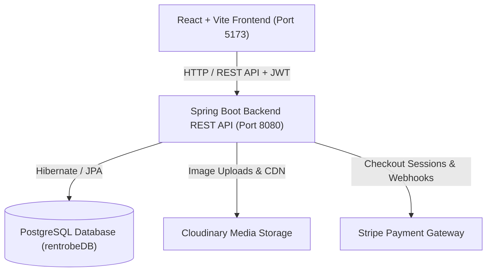
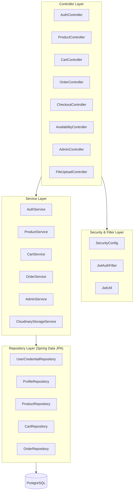
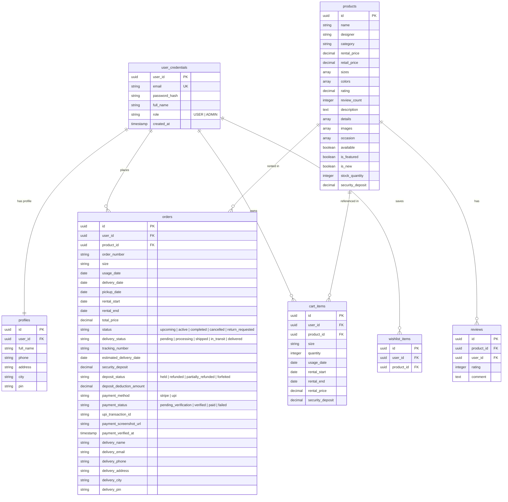

# RentRobe

RentRobe is a clothing rental platform developed by Kundan Keshri.

---

## Author

Developed and maintained by Kundan Keshri.

(c) 2026 RentRobe. All Rights Reserved.

Unauthorized copying, reproduction, modification, redistribution,
or commercial use of this project or substantial portions of its
source code is prohibited without prior written permission.

---

## Table of Contents

- [Overview](#overview)
- [Rental Booking Model](#rental-booking-model)
- [System Architecture](#system-architecture)
- [Database Schema](#database-schema)
- [Key Features](#key-features)
- [Tech Stack](#tech-stack)
- [Getting Started](#getting-started)
  - [Prerequisites](#prerequisites)
  - [Database Configuration](#database-configuration)
  - [Environment Variables](#environment-variables)
  - [Running the Backend](#running-the-backend)
  - [Running the Frontend](#running-the-frontend)
- [API Reference](#api-reference)
- [Security and Authentication](#security-and-authentication)

---

## Overview

RentRobe bridges the gap between high-end designer fashion and affordability by allowing users to rent outfits for specific events. Instead of requiring users to calculate multi-day rental durations manually, RentRobe utilizes a simplified single-date selection model that automatically coordinates delivery, event wear, and return pickup.

---

## Rental Booking Model

RentRobe operates on an event-driven 3-day rental lifecycle:

1. **Customer Selection**: The customer selects only their **Usage Date** (the date they will wear the outfit).
2. **Automated Lifecycle Derivation**:
   - **Delivery Date** = `Usage Date - 1 Day` (Garment arrives a day in advance for fittings).
   - **Usage Date** = Event Day (Customer wears the garment).
   - **Pickup Date** = `Usage Date + 1 Day` (RentRobe logistics team collects the garment during the day).
3. **Transparent Pricing**:
   - Total Cost = `Rental Price * Quantity + Refundable Security Deposit`
   - Delivery and return pickup are completely free.
   - No damage protection fees.

---

## System Architecture

The application is structured as a decoupled client-server architecture:



### Backend Components



---

## Database Schema



---

## Key Features

### Customer Experience
- **Usage Date Booking**: Intuitive calendar date selection with conflict checking across the 3-day rental lifecycle.
- **Product Catalog & Filters**: Explore outfits by category (Lehengas, Sarees, Gowns, Outerwear), designer, occasion, and size.
- **Cart & Wishlist**: Persistent cart with guest-to-account migration upon login and wishlist management.
- **Dual Payment Methods**:
  - **Stripe Card Checkout**: Direct payment processing.
  - **UPI QR Code Payment**: Instant UPI transfer with payment screenshot upload for verification.
- **User Dashboard**: Track active rentals, view order details, monitor courier tracking, and submit product reviews.

### Administration Suite
- **Analytics Overview**: View platform revenue, total orders, active rentals, and pending payments.
- **Product Catalog Management**: Create, update, upload images, and manage inventory stock quantities.
- **UPI Payment Verification**: Review submitted transaction IDs and payment screenshots with one-click approve/reject actions.
- **Order Tracking & Logistics**: Assign tracking numbers, update delivery statuses, and configure estimated arrival dates.
- **Security Deposit Operations**: Manage deposit status (Held, Refunded, Partially Refunded, Forfeited) and apply deduction amounts.

---

## Tech Stack

### Frontend
- **Framework**: React 18 + Vite + TypeScript
- **Styling**: Tailwind CSS + Shadcn UI + Lucide Icons
- **Animation**: Framer Motion
- **Date Utilities**: Date-fns
- **HTTP Client**: Axios with interceptors
- **State Management**: React Context (Auth, Cart, Wishlist)
- **Routing**: React Router DOM v6

### Backend
- **Framework**: Java 17 + Spring Boot 3.3.5
- **Security**: Spring Security + Stateless JWT Authentication
- **Database Access**: Spring Data JPA + Hibernate ORM
- **Database**: PostgreSQL 14+
- **Media Engine**: Cloudinary Java SDK
- **Payment Processing**: Stripe Java SDK

---

## Getting Started

### Prerequisites

Ensure you have the following installed on your system:
- Java JDK 17 or higher
- Node.js 18.x or higher
- PostgreSQL 14 or higher
- Apache Maven (or bundled Maven script)

---

### Database Configuration

1. Create a PostgreSQL database named `rentrobeDB`:
   ```sql
   CREATE DATABASE "rentrobeDB";
   ```

2. Update database credentials in `backend/src/main/resources/application.yml` or `application.properties`:
   ```yaml
   spring:
     datasource:
       url: jdbc:postgresql://localhost:5432/rentrobeDB
       username: postgres
       password: your_password
       driver-class-name: org.postgresql.Driver
     jpa:
       hibernate:
         ddl-auto: update
       show-sql: false
   ```

---

### Environment Variables

Configure environment variables in a `.env` file in the project root:

```env
# Frontend Configuration
VITE_API_URL="http://localhost:8080"

# Cloudinary Storage Configuration
CLOUDINARY_CLOUD_NAME="your-cloud-name"
CLOUDINARY_API_KEY="your-api-key"
CLOUDINARY_API_SECRET="your-api-secret"

# Stripe Configuration (Optional for online card payments)
STRIPE_SECRET_KEY="your-stripe-secret-key"
```

---

### Running the Backend

From the project root:

```powershell
# Run using Maven
mvn clean spring-boot:run -f backend/pom.xml
```

The Spring Boot backend will start on `http://localhost:8080`.

---

### Running the Frontend

From the project root in a separate terminal:

```powershell
# Install dependencies
npm install

# Start Vite development server
npm run dev
```

The application will be accessible at `http://localhost:5173`.

---

## API Reference

### Authentication
| Method | Endpoint | Description | Access |
|--------|----------|-------------|--------|
| `POST` | `/api/auth/register` | Register new customer account | Public |
| `POST` | `/api/auth/login` | Authenticate and retrieve JWT token | Public |
| `GET` | `/api/auth/profile` | Retrieve authenticated user profile | Authenticated |
| `PUT` | `/api/auth/profile` | Update user profile details | Authenticated |

### Products
| Method | Endpoint | Description | Access |
|--------|----------|-------------|--------|
| `GET` | `/api/products` | Retrieve paginated products with filters | Public |
| `GET` | `/api/products/{id}` | Retrieve product details by ID | Public |
| `POST` | `/api/products` | Create a new product | Admin |
| `PUT` | `/api/products/{id}` | Update product information | Admin |
| `DELETE` | `/api/products/{id}` | Delete product from catalog | Admin |
| `POST` | `/api/products/upload-image` | Upload image to Cloudinary | Admin |

### Cart & Availability
| Method | Endpoint | Description | Access |
|--------|----------|-------------|--------|
| `GET` | `/api/cart` | Get active cart items for user | Authenticated |
| `POST` | `/api/cart` | Add item to cart with usage dates | Authenticated |
| `PUT` | `/api/cart/{id}` | Update item quantity | Authenticated |
| `DELETE` | `/api/cart/{id}` | Remove item from cart | Authenticated |
| `DELETE` | `/api/cart` | Clear all items from cart | Authenticated |
| `GET` | `/api/availability/{productId}` | Check booked date windows | Public |
| `POST` | `/api/checkout/validate` | Validate item availability before checkout | Authenticated |

### Orders & Checkout
| Method | Endpoint | Description | Access |
|--------|----------|-------------|--------|
| `POST` | `/api/checkout/stripe` | Create Stripe checkout session | Authenticated |
| `POST` | `/api/checkout/upi` | Submit UPI payment order with proof | Authenticated |
| `GET` | `/api/orders` | List current user order history | Authenticated |
| `GET` | `/api/orders/{id}` | Retrieve detailed order information | Authenticated |
| `POST` | `/api/orders/{id}/return` | Request garment return pickup | Authenticated |

### Admin Operations
| Method | Endpoint | Description | Access |
|--------|----------|-------------|--------|
| `GET` | `/api/admin/orders` | Retrieve all customer orders | Admin |
| `PUT` | `/api/admin/orders/{id}` | Update tracking and deposit info | Admin |
| `POST` | `/api/admin/orders/{id}/verify-payment` | Verify or reject UPI payment | Admin |
| `POST` | `/api/admin/users/profiles` | Batch retrieve customer profiles | Admin |

---

## Security and Authentication

- **Stateless JWT Authorization**: Requests use Bearer tokens sent in the HTTP `Authorization` header.
- **Role-Based Access Control**: Strict segregation between `USER` and `ADMIN` endpoints enforced via Spring Security filters.
- **CORS Protection**: Fine-grained CORS configuration allowing preflight requests and credentialed client connections.
- **SQL Injection Prevention**: Parameterized queries through Spring Data JPA / Hibernate ORM.
